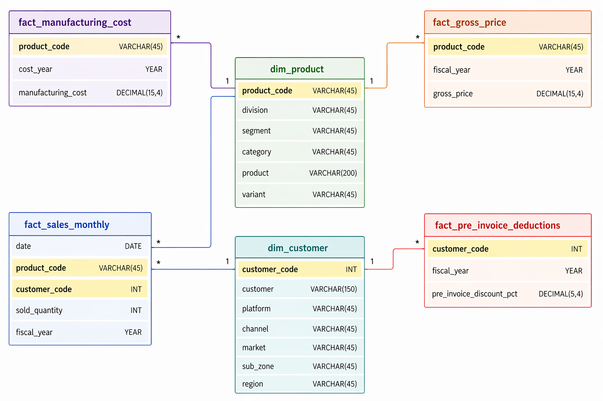
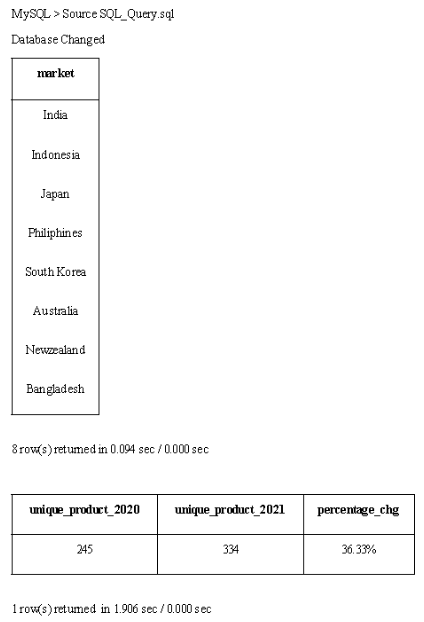

# AtliQ Hardware - SQL Challenge: Consumer Goods Insights

## 📋 Overview

| Field | Details |
|---|---|
| **Domain** | Consumer Goods |
| **Function** | Executive Management |
| **Tools Used** | MySQL, GitHub |

## 🧩 Problem Statement

AtliQ Hardware (imaginary company) is one of the leading computer hardware producers in India, with a significant presence in other countries as well. However, the management noticed they were not receiving enough insights to make quick, smart, data-informed decisions.

To address this, the company decided to conduct an **SQL challenge** to better understand its data.

---

## 🎯 Task

- Review [`ad-hoc-requests.pdf`](RAW/ad-hoc-requests.pdf) — it contains **10 ad hoc business requests** that require data insights.
- Write SQL queries to answer each of those requests.
- Create a **presentation for top-level management** showcasing the insights.

---

## 🗄️ Data Model

> **

---

## ⚙️ Setup & Database Creation

### Step 1 — Connect to MySQL via Terminal

```bash
mysql -u root -p
```

Enter your password when prompted.

### Step 2 — Create the Database

Once connected successfully, run:

```bash
source RAW_Files/atliq_hardware_db.sql
```

This will generate AtliQ Hardware's database from the [`atliq_hardware_db.sql`](RAW/atliq_hardware_db.sql) file.

---

## 🔍 Running SQL Queries

Run all queries using MySQL terminal or MySQL Workbench.

**Via terminal:**

```bash
source SQL_Query.sql
```

> 📸 **

---

## 📊 Reports & Presentations

### Reports

- [`SQL_Query_Solutions.pdf`](SQL_Query_Solutions.pdf) — Contains all 10 questions along with their terminal outputs.

### Presentations

> 📸 **

The management presentation is available in two formats:

| Format | File |
|---|---|
| PDF | [`Presentation.pdf`](Presentation.pdf) |
| PowerPoint | [`Presentation.pptx`](Presentation.pptx) |

---

## 📎 Additional Resources

For full problem statement details and dataset information, visit:
👉 [codebasics.io](https://codebasics.io)
